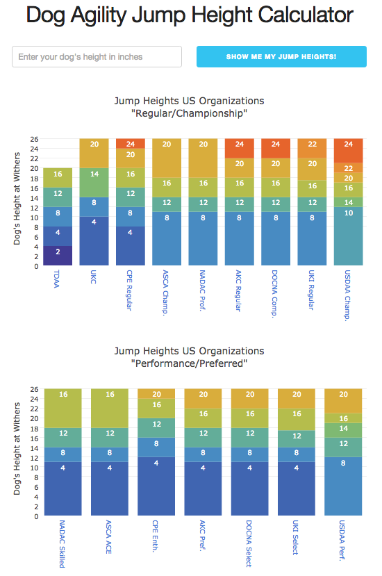

## Synopsis

Quick and dirty JavaScript code for an interactive web page showing US dog agility jump heights and calculating applicable jump heights given a dog's height at the withers.
Uses [Plotly.js](https://plot.ly/javascript/) for graphing, [Lodash](https://lodash.com/) for data wrangling, and [Skeleton](http://getskeleton.com/) for some CSS goodness.

Here's what it looks like:

## Demo

You can see this page in action at [http://agilitynerd.com/jumpheights/](http://www.agilitynerd.com/jumpheights/).

## Motivation

Lately there have been a lot of discussions about jump heights due to the USDAA adjusting some of their jump heights external link. That got me thinking that it would be helpful to create a chart to let competitors visually compare the jump heights and dog height cutoffs for the primary US organizations and their competition programs. Of course once I did that I figured out that it wouldn't be much more work to automatically calculate a dog's jump height when you type in your dog's height at the withers.

## License

See the [LICENSE](license.txt) file for details.